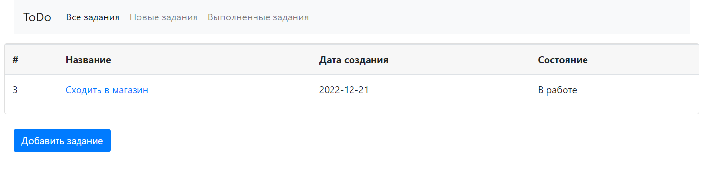
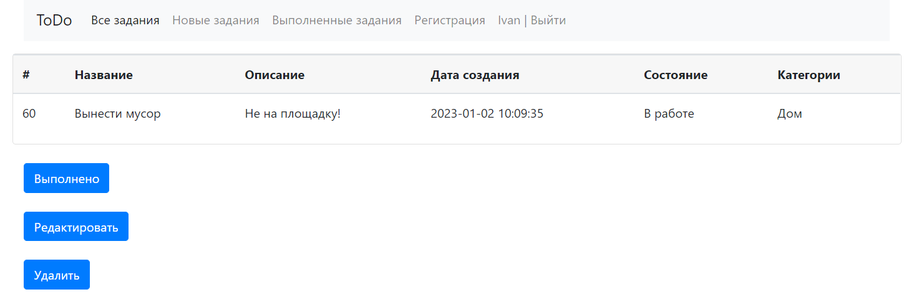

## TODO list

Приложение TODO list, в котором можно добавлять, удалять 
и просматривать выполненные задания по средствам web интерфейса.

### Стек технологий:
 - java 16;
 - Spring boot, 
 - Thymeleaf,
 - Bootstrap,
 - Postgresql
 - Hibernate, 
 - Liquibase,
 - Lombok.

### Требования к окружению :
 - java 16+;
 - maven 4.0.0;
 - Postgresql 13+;

### Запуск приложения

Запуск с помощью командной строки:

1. Перейти в папку с проектом.
2. Выполнить команду: mvn liquibase:update
3. Выполнить команду: mvn clean install
4. Выполнить команду: mvn spring-boot:run
5. Перейти по ссылке: http://localhost:8080

 ### Все задачи

### Подробное описание задачи

 Контакты:
@WhiteVax