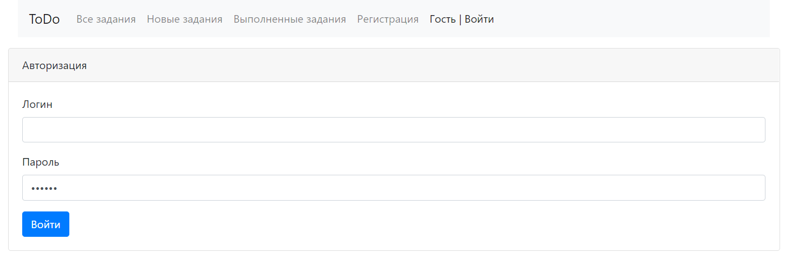
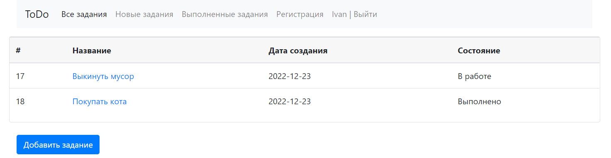
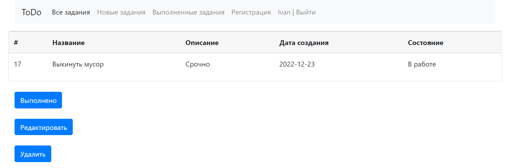

## TODO list

Приложение TODO list, в котором можно добавлять, удалять 
и просматривать выполненные задания по средствам web интерфейса.

### Стек технологий:
 - java 17;
 - Spring boot 2.7.4; 
 - Thymeleaf 2.7.4;
 - Bootstrap 4;
 - Postgresql 42.2.9;
 - Hibernate 5.6.11; 
 - Liquibase 4.15.0;
 - H2 2.1.214;
 - Lombok 1.18.24.

### Требования к окружению :
 - java 17+;
 - maven 4.0.0;
 - Postgresql 13+;

### Запуск приложения

Запуск с помощью командной строки:

1. Перейти в папку с проектом.
2. Выполнить команду: mvn liquibase:update
3. Выполнить команду: mvn clean install
4. Выполнить команду: mvn spring-boot:run
5. Перейти по ссылке: http://localhost:8080

### Панель входа

### Все задачи

### Подробное описание задачи

 Контакты:
@WhiteVax