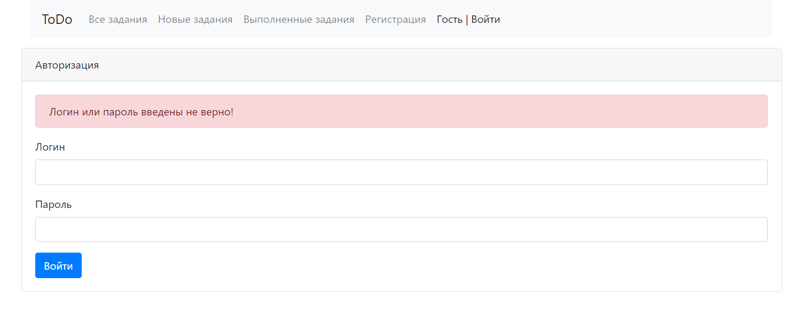
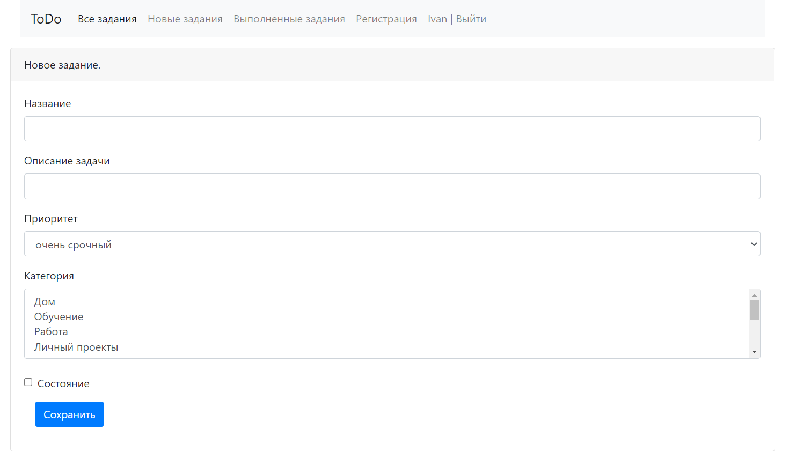
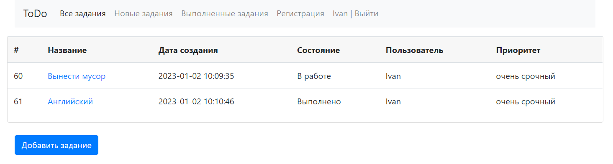
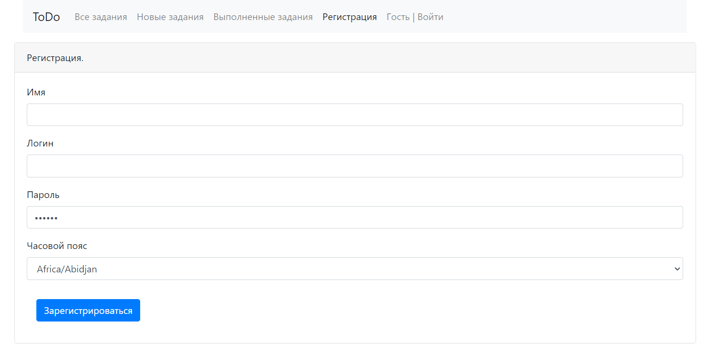
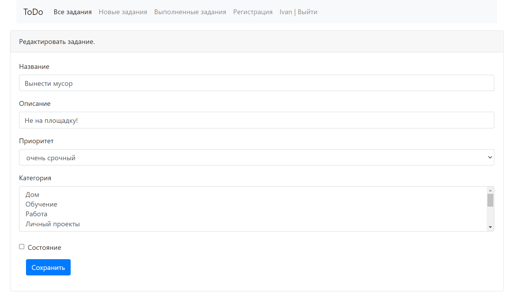

## TODO list

Приложение TODO list, в котором можно добавлять, удалять 
и просматривать выполненные задания по средствам web интерфейса.

### Стек технологий:

- 
- 
- 
- 
- 
- 
- 
- 
- 
- 

### Требования к окружению :

- 
- 
- 

### Запуск приложения

Запуск с помощью командной строки:

1. Перейти в папку с проектом.
2. Выполнить команду: mvn liquibase:update
3. Выполнить команду: mvn clean install
4. Выполнить команду: mvn spring-boot:run
5. Перейти по ссылке: http://localhost:8080

### Окно входа

### Окно добавления задачи

### Окно всех задач

### Подробней задача

### Окно регистрации

### Окно редактирования задачи

 Контакты:
@WhiteVax